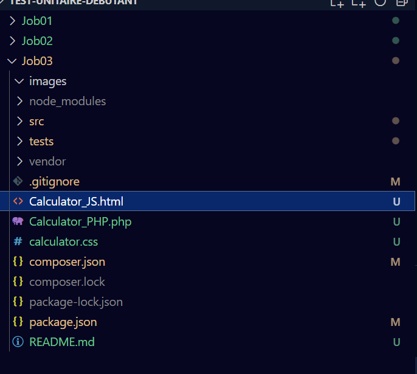
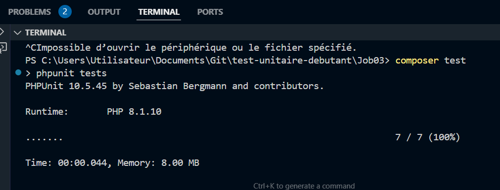
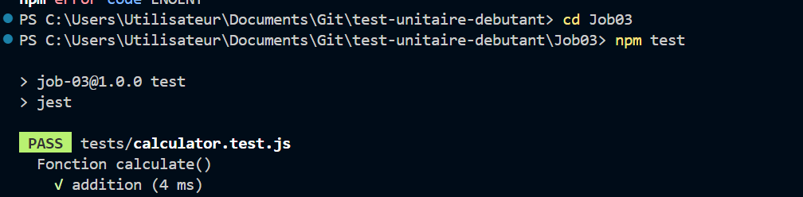

#  Validation des Calculs avec Tests Unitaires en PHP et JavaScript

Ce projet vise à assurer la fiabilité des opérations de deux calculatrices, développées en PHP et en JavaScript

---

## 📂 Organisation générale

Le dépôt est structuré pour séparer distinctement le code applicatif, les fichiers de tests, les ressources visuelles et les interfaces utilisateur.

---

## ⚙️ Partie PHP

---

## ⚙️ Partie JavaScript

La page `Calculator_JS.html` utilise une fonction JavaScript pour analyser et calculer les expressions saisies par l’utilisateur.

---

## ✅ Tests unitaires PHP avec PHPUnit

Les tests sont regroupés dans le fichier `tests/CalculatorTest.php`. Chaque test cible un aspect spécifique des calculs, comme les opérations basiques ou la gestion des erreurs.

Pour exécuter les tests, lancez la commande suivante dans le terminal :

vendor/bin/phpunit tests

---

## ✅ Tests unitaires JavaScript avec Jest

Les scénarios de test JavaScript sont définis dans `tests/calculator.test.js` et couvrent l’ensemble des fonctionnalités de la calculatrice.

Pour démarrer les tests, utilisez la commande :

npm test

---

## 🎯 Compétences acquises

- Installation et configuration des outils de test PHPUnit et Jest
- Développement de fonctions calculatoires testables
- Couverture complète des cas d’usage, simples et complexes
- Identification et correction des dysfonctionnements
- Rédaction d’une documentation claire et complète

---
